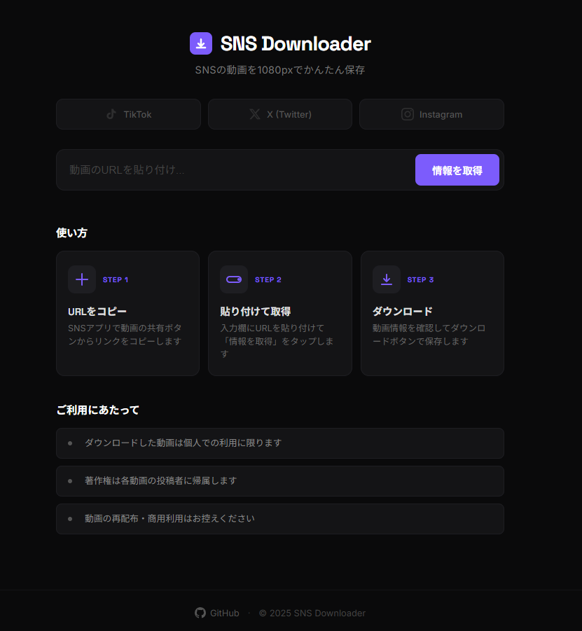

# SNS Downloader

> **https://sns-downloader.com**

TikTok・X(Twitter)・Instagram の動画を最大1080pで保存できるWebアプリケーション。

<p align="center">
  
</p>

## 機能

- TikTok / X(Twitter) / Instagram の動画ダウンロード
- 最大1080p画質対応
- サムネイル・動画情報のプレビュー表示
- 100MBまでの動画に対応

## 技術スタック

- **バックエンド**: Node.js + Express
- **動画取得**: yt-dlp + ffmpeg
- **リバースプロキシ**: Nginx (SSL終端)
- **SSL証明書**: Let's Encrypt (Certbot)
- **コンテナ**: Docker + Docker Compose

## ローカル開発

```bash
npm install
npm start
```

http://localhost:3000 でアクセスできます。

> ローカル実行には [yt-dlp](https://github.com/yt-dlp/yt-dlp) と [ffmpeg](https://ffmpeg.org/) が必要です。

## デプロイ (EC2)

### 1. 初回セットアップ

```bash
curl -fsSL https://raw.githubusercontent.com/minaR0404/sns-downloader/main/deploy/setup.sh | bash
```

### 2. HTTPS設定

```bash
cd ~/sns-downloader
bash deploy/init-letsencrypt.sh <ドメイン名> <メールアドレス>
```

### 3. 再デプロイ

```bash
cd ~/sns-downloader
git pull
sudo docker-compose up -d --build
```

## ライセンス

ISC
